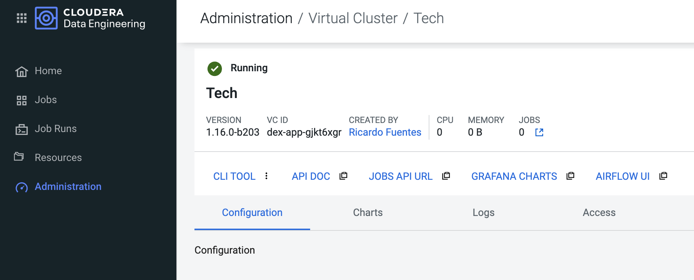
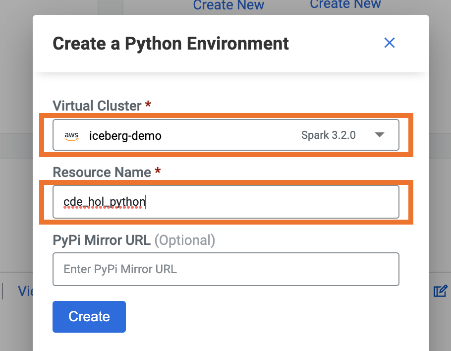

# Step by Step Guide - ENG


## Requirements

In order to execute the Hands On Labs you need:
* A Spark 3 and Iceberg-enabled CDE Virtual Cluster (Azure, AWS and Private Cloud ok).
* No script code changes are required other than entering your Storage Bucket and Credentials at the top of each script.
* Familiarity with Python and PySpark is highly recommended.
* The files contained in the data folder should be manually loaded in the Storage Location of choice. If you are attending a CDE ACE Workshop, this will already have been done for you. Please validate this with your Cloudera Workshop Lead.  


## Project Setup

Clone this GitHub repository to your local machine or the VM where you will be running the script.

```
mkdir ~/Documents/cde_ace_hol
cd ~/Documents/cde_ace_hol
git clone https://github.com/pdefusco/CDE_Tour_ACE_HOL.git
```

Alternatively, if you don't have GitHub create a folder on your local computer; navigate to [this URL](https://github.com/pdefusco/CDE_Tour_ACE_HOL.git) and download the files.

## Introduction to the CDE Data Service

Cloudera Data Engineering (CDE) is a serverless service for Cloudera Data Platform that allows you to submit batch jobs to auto-scaling virtual clusters. CDE enables you to spend more time on your applications, and less time on infrastructure.

Cloudera Data Engineering allows you to create, manage, and schedule Apache Spark jobs without the overhead of creating and maintaining Spark clusters. With Cloudera Data Engineering, you define virtual clusters with a range of CPU and memory resources, and the cluster scales up and down as needed to run your Spark workloads, helping to control your cloud costs.

The CDE Service can be reached from the CDP Home Page by clicking on the blue "Data Engineering" icon.


The CDE Landing Page allows you to access, create and manage CDE Virtual Clusters. Within each CDE Virtual Cluster you can  create, monitor and troubleshoot Spark and Airflow Jobs.

The Virtual Cluster is pegged to the CDP Environment. Each CDE Virtual Cluster is mapped to at most one CDP Environment while a CDP Environment can map to one or more Virtual Cluster.

These are the most important components in the CDE Service:

##### CDP Environment
A logical subset of your cloud provider account including a specific virtual network. CDP Environments can be in AWS, Azure, RedHat OCP and Cloudera ECS. For more information, see [CDP Environments](https://docs.cloudera.com/management-console/cloud/overview/topics/mc-core-concepts.html).

##### CDE Service
The long-running Kubernetes cluster and services that manage the virtual clusters. The CDE service must be enabled on an environment before you can create any virtual clusters.

##### Virtual Cluster
An individual auto-scaling cluster with defined CPU and memory ranges. Virtual Clusters in CDE can be created and deleted on demand. Jobs are associated with clusters.

##### Jobs
Application code along with defined configurations and resources. Jobs can be run on demand or scheduled. An individual job execution is called a job run.

##### Resource
A defined collection of files such as a Python file or application JAR, dependencies, and any other reference files required for a job.

##### Job Run
An individual job run.

Next, familiarize yourself with the CDE Landing page. Scroll down to the CDE Virtual Clusters section.  


Open the Virtual Cluster Details icon of your Virtual Cluster as shown above. Familiarize yourself with the Cluster's basic features including the Airflow UI, the CDE API Documentation, Graphana Dashboards and more.




## Part 1: Implement a Spark Pipeline

#### Summary

In this section you will execute four Spark jobs from the CDE UI. You will store files and python virtual environments in CDE Resources, migrate Spark tables to Iceberg tables, and use some of Iceberg's most awaited features including Time Travel, Incremental Queries, Partition and Schema Evolution.

#### Creating CDE Resources

CDE Resources can be of type "File", "Python", or "Custom Runtime".

To create a File Resource, from the CDE Home Page click on "Create New" in the "Resources" -> "File" section.


Pick your Spark 3 / Iceberg-enabled CDE Virtual Cluster and assign a name to your Resource.


Upload all files from the "cde_ace_hol/cde_spark_jobs" folder. Then, navigate back to the Resources tab, reopen the resource and upload the two Airflow DAGs from the "cde_ace_hol/cde_airflow_jobs" folders. Finally, reopen the resource and upload the "utils.py" file contained in the "cde_ace_hol/resources_files" folder.

NB: In order to load the files from the three folders, you will have to manually upload the files three times. When you are done, ensure you have a total of 13 files in your Resource:


To create a Python Resource, navigate back to the CDE Home Page and click on "Create New" in the "Resources" -> "Python" section.


Ensure to select the same CDE Virtual Cluster. Name the Python CDE Resource and leave the pipy mirror field blank.



Upload the "requirements.txt" file provided in the "cde_ace_hol/resources_files" folder.


Notice the CDE Resource is now building the Python Virtual Environment. After a few moments the build will complete and you will be able to validate the libraries used.


#### Creating CDE Spark Jobs

Next we will create four CDE Jobs of type Spark using scripts "01_Pre_Setup.py", "02_EnrichData_ETL.py", "03_Spark2Iceberg.py" and "04_Sales_Report.py" located in the "cde_ace_hol/cde_spark_jobs" folder.

>**⚠ Warning**  
> Before moving forward, you have to edit each of the four scripts with your credentials:
> data_lake_name, s3BucketName and username
> These variables are already present at the top of each script for you, but you should update their values
> The username is arbitrary but has to be consistent across all scripts
> The data_lake_name is normally provided by your Cloudera Workshop Lead or CDP / Cloud Admin
> The s3BucketName variable is only required in script "04_Sales_Report.py"

Navigate back to the CDE Home Page. Click on "Create New" in the "Jobs" -> "Spark" section.


Select your CDE Virtual Cluster and assign "O1_Setup" as the Job Name.


Scroll down; ensure to select "File" from the radio button and click on "Select from Resource" in the "Application File" section. A window will open with the contents loaded in your File Resource. Select script "01_Pre_Setup.py".


Scroll down again to the "Resources" section and notice that your File Resource has been mapped to the Job by default. This allows the PySpark script to load modules in the same Resource such as the ones contained in the "utils.py" file.

Scroll to the bottom and click on the "Create and Run" blue icon.


You will be automatically taken to the Jobs tab where the Job will now be listed at the top. Open the Job Runs tab on the left pane and validate that the CDE Spark Job is executing.


When complete, a green checkmark will appear on the left side. Click on the Job Run number to explore further.


The Job Run is populated with Metadata, Logs, and the Spark UI. This information is persisted and can be referenced at a later point in time.

The Configuration tab allows you to verify the script and resources used by the CDE Spark Job.


The Logs tab contains rich logging information. For example, you can verify your code output under "Logs" -> "Driver" -> "StdOut".


The Spark UI allows you to visualize resources, optimize performance and troubleshoot your Spark Jobs.


Now that you have learned how to create a CDE Spark Job with the CDE UI, repeat the same process with the following scripts and settings. Leave all other options to their default. Allow each job to complete before creating and executing a new one.

```
Job Name: 02_EnrichData_ETL
Type: Spark
Application File: 02_EnrichData_ETL.py
Resource(s): cde_hol_files (or your File Resource name if you used a different one)

Job Name: 03_Spark2Iceberg
Type: Spark
Application File: 03_Spark2Iceberg.py
Resource(s): cde_hol_files

Job Name: 04_Sales_Report
Type: Spark
Python Environment: cde_hol_python
Application File: 04_Sales_Report.py
Job Resource(s): cde_hol_files
```

>**Note**  
>The Iceberg Jars did not have to be loaded in the Spark Configurations. Iceberg is enabled at the Virtual Cluster level.
>Job 04_Sales_Report uses the Quinn Python library. The methods are implemented in utils.py which is loaded via the File Resource.   

## Part 2: Orchestrating Pipelines with Airflow

#### Summary

You will build three Airflow jobs to schedule, orchestrate and monitor actions of different types.

In the first, you will build a basic Airflow DAG to break up a similar pipeline to the one you built in Part 1. This will be a simple sequence of two Spark jobs.

In the second DAG you will get a tour of Airflow's most recommended operators in CDE. You will familiarize yourself with operators to run bash commands, python methods, and interact with external 3rd party systems.

Airflow task scheduling allows you to implement advanced logic and interdependencies within your pipelines. With the last Airflow DAG, you will get a flavor of Airflow task scheduling with a simple workflow that breaks up a Spark Join into three separate joins.


## Part 3: Using the CDE CLI

#### Summary

The majority of large scale CDE implementations rely on the CDE API and CLI. With them, you can easily interact with CDE from a local IDE and build integrations with external 3rd party systems. For example, you can implement multi-CDE cluster workflows with GitLabCI or Python.  

In this part of the workshop you will gain familiarity with the CDE CLI by rerunning the same jobs and interacting with the service remotely.

### Conclusion

Congratulations for making it to the end of this tutorial! We hope you enjoyed using CDE first hand. We recommend visiting the [Next Steps Section](https://github.com/pdefusco/CDE_Tour_ACE_HOL#next-steps) to continue your journey with CDE.


